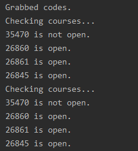

# uci-class-bot
A bot that regularly checks for course openings at UCI and will automatically register for them when open.  

The program will parse WebSoc using BS4 to determine whether a course is open. The bot will attempt to register for the course through WebReg using Selenium. 

This bot was built specifically for UCI's registrar website in 2020. As it is dependent on parsing the HTML, any changes to UCI's website will affect the usability of this program.

The intention of this project was to practice making HTTP requests and using external libraries.

## Examples

The following explanation will demonstrate ONLY the program's ability to check for course availability.

`courses.txt` will contain the desired course code(s) in the following format. Each line will represent a different course followed by co-courses.
```
[Lecture] [Discussion]
35470 35471 35472 35473
26860 26861
26845
```

Example output after running for 30 seconds.



## Disclaimer
This bot was made and intended for educational purposes only. Actual usage of any applications that unfairly give a user any advantage over other students while registering for classes violates OAISC standards.  

We are not responsible for the misuse of this program.
